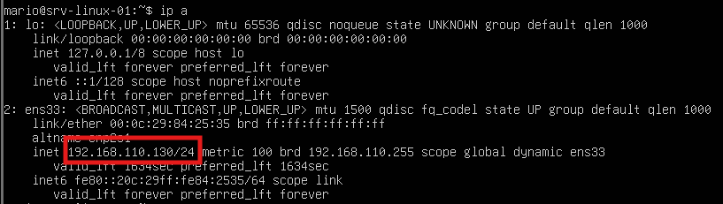
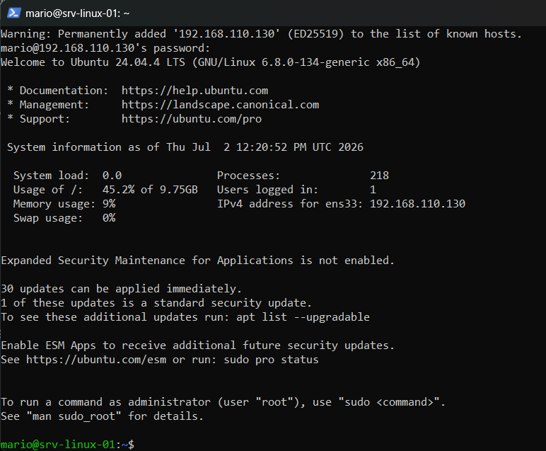

# Despliegue-y-Aseguramiento-de-Servidor-Web-Empresarial-en-Linux-Ubuntu-Server-
1. Descripción del Proyecto
Este laboratorio práctico simula un entorno de producción real mediante el despliegue desde cero de un servidor empresarial basado en Ubuntu Server 24.04 LTS virtualizado en VMware Workstation.

El objetivo principal es demostrar competencias sólidas en la administración de sistemas Linux sin interfaz gráfica, gestión de servicios web modernos, configuración perimetral de seguridad (Firewall) y persistencia de red, operando el servidor de forma remota mediante SSH tal como se gestiona en entornos corporativos reales.

2. Tecnologías y Herramientas Utilizadas
Hipervisor: VMware Workstation

Sistema Operativo: Ubuntu Server 24.04 LTS (Sin entorno gráfico)

Servidor Web: Nginx

Seguridad: UFW (Uncomplicated Firewall) / OpenSSH Server

Gestor de Red: Netplan (YAML)

Consola de Administración: Windows PowerShell / CMD (Cliente SSH integrado)

3. Fases del Despliegue y Configuración
Fase 1: Inicialización del Sistema y Conexión Remota (SSH)
Para cumplir con las buenas prácticas de administración, el servidor se gestiona de forma 100% remota, evitando el uso directo de la consola del hipervisor.

Se realizó la instalación limpia de Ubuntu Server, activando el servicio OpenSSH Server.

Tras el arranque, se auditó la interfaz de red para identificar la dirección IP dinámica asignada por el entorno local.

Comando utilizado para auditar el direccionamiento de la máquina:
ip a

Se estableció la conexión remota desde la máquina anfitriona (Windows) utilizando las credenciales de administración local.

Conexión SSH desde el terminal de Windows:
ssh mario@192.168.110.130

Fase 2: Implementación y Personalización del Servicio Web (Nginx)
Se optó por Nginx debido a su alto rendimiento, escalabilidad y bajo consumo de recursos en entornos de producción.

Se actualizaron los repositorios locales y se procedió con la instalación del servicio:
sudo apt update && sudo apt install nginx -y

Se verificó que el demonio del servicio se encontrara en estado de ejecución activo (active running):
sudo systemctl status nginx

[AQUÍ INSERTA TU CAPTURA 3: El estado del servicio Nginx en verde]

Se modificó el archivo index principal localizado en la ruta de producción (/var/www/html/) utilizando el editor nano para personalizar la landing page corporativa del servidor.

Se comprobó el correcto funcionamiento accediendo a través del navegador web del equipo local.

[AQUÍ INSERTA TU CAPTURA 4: El navegador web abriendo la IP del servidor con tu web personalizada]

Fase 3: Hardening Perimetral (Configuración de Firewall UFW)
Un servidor en producción no debe exponer puertos innecesarios. Se aplicó una política de seguridad restrictiva mediante el firewall nativo UFW.

Se definieron las reglas exclusivas para permitir el tráfico web (Puerto 80/443) y de administración remota (Puerto 22):
sudo ufw allow 'Nginx Full'
sudo ufw allow ssh

Se habilitó el firewall del sistema y se auditó la persistencia y estado de las reglas:
sudo ufw enable
sudo ufw status verbose

La política por defecto pasó a denegar (deny) todo el tráfico entrante no explícito, mitigando vectores de ataque comunes.

[AQUÍ INSERTA TU CAPTURA 5: El estado detallado del firewall mostrando las reglas activas]

Fase 4: Persistencia y Configuración de Red Estática (Netplan)
Para evitar la pérdida de conectividad debido a variaciones en la asignación dinámica de IPs (DHCP), se configuró un direccionamiento estático permanente modificando los archivos de configuración de Netplan en formato YAML.

Se editó el archivo de configuración asignando la IP del servidor de forma estática, declarando los DNS (8.8.8.8, 1.1.1.1) y mapeando la puerta de enlace nativa.

Se aplicaron los cambios en caliente garantizando la estabilidad de la infraestructura:
sudo netplan apply

[AQUÍ INSERTA TU CAPTURA 6: Tu archivo .yaml modificado o el comando aplicado con éxito]

4. Conclusiones y Aprendizajes Adquiridos
Administración Headless: Adquisición de soltura en entornos CLI (interfaz de línea de comandos) orientados a servidores reales.

Seguridad Básica: Aplicación del principio de mínimo privilegio en redes cerrando puertos redundantes.

Infraestructura como Código (IaC básica): Comprensión del formato estructurado YAML para el despliegue y control de configuraciones críticas de red.
